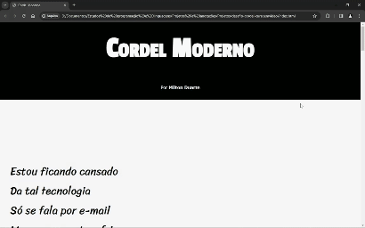

# CursoemVideo - Desafio Cordel

Essa é a minha versão do desafio 12 do [CursoemVideo](https://www.youtube.com/watch?v=Ejkb_YpuHWs&list=PLHz_AreHm4dkZ9-atkcmcBaMZdmLHft8n) sobre o uso de background-image.

## Proposta do desafio:

Utilizar o conhecimento obtido no módulo 3 do curso de HTML e CSS para criar um site que possua imagens com efeito de parallax e com fonte adaptável.
